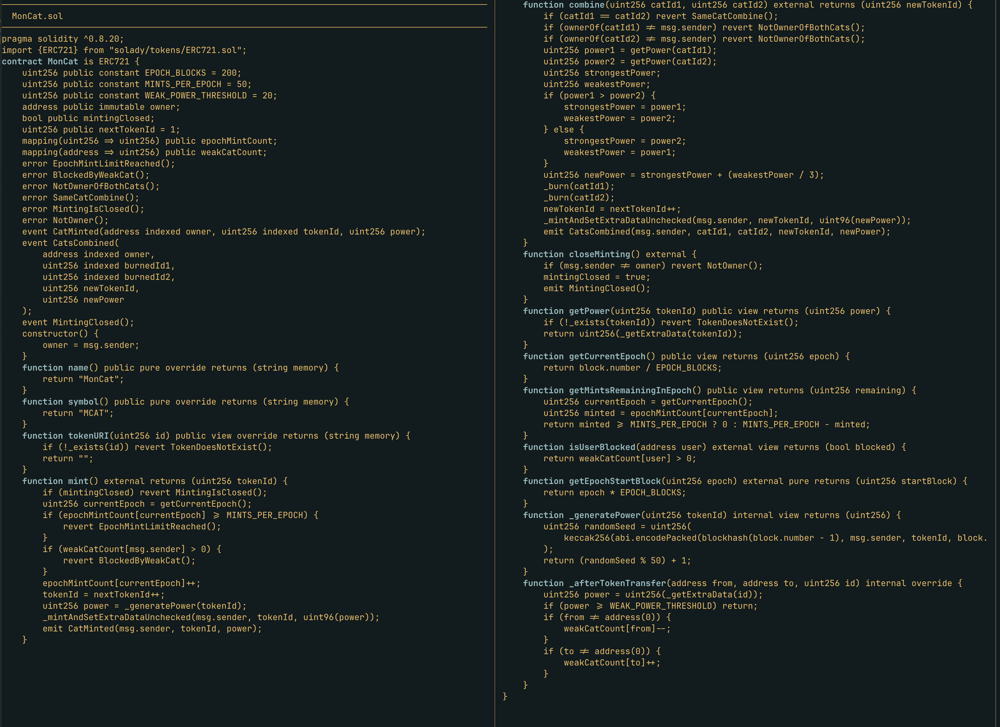

# solreview

A terminal-based Solidity code review tool with dense, multi-column display.

Vibecoded. Use at your own risk. No depenencies.



## Usage

```bash
python3 solreview.py /path/to/contracts
```

## Features

- Recursively finds all `.sol` files
- Strips comments for cleaner view
- Multi-column layout (80 char min per column)
- Highlights definitions: `contract`, `library`, `interface`, `function`, `modifier`
- Keyboard navigation with pagination

## Navigation

| Key | Action |
|-----|--------|
| 1-9 | Jump to page |
| n / Space | Next page |
| p / b | Previous page |
| q | Quit |
